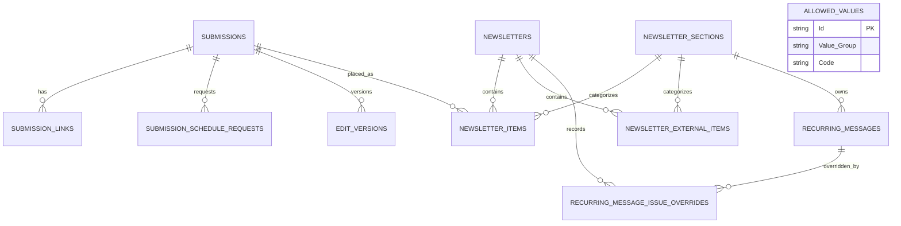

# Data Model

This document describes the current SQLAlchemy ORM surface for the UCM Daily
Register application. It is intended to be the human-readable schema inventory
for engineers, data stewards, and governance reviewers.

!!! info "Source of truth"
    The SQLAlchemy models in `backend/app/models/` define the application schema.
    Alembic migrations define reproducible schema evolution. Seed JSON under
    `backend/data/` defines bootstrap reference data, not the expected contents
    of long-lived dev or production databases.

## Portfolio Naming Convention

UCM follows the UI Insight / AI4RA-UDM column naming convention:
`PascalCase_With_Underscores`, such as `Target_Newsletter`, `Created_At`, and
`Submission_Id`.

The application intentionally differs from OpenERA in two ways:

- Table names are lowercase plural, such as `submissions` and `newsletters`.
- Primary keys are UUID strings named `Id` rather than UDM-style
  `{Entity}_ID` columns.

These differences are documented in the UDM alignment report and should be
treated as legacy application conventions, not the preferred pattern for new
governed applications.

## Entity Overview

| Area | Tables | Purpose |
|---|---|---|
| Controlled vocabularies | `allowed_values` | Database-backed pick lists and status/type codes |
| Submission intake | `submissions`, `submission_links`, `submission_schedule_requests` | Public and staff-submitted newsletter content, links, and requested run dates |
| Editorial history | `edit_versions` | Immutable original, AI-suggested, and editor-final snapshots |
| Newsletter assembly | `newsletters`, `newsletter_items`, `newsletter_external_items`, `newsletter_sections` | Dated issues, section placement, and imported calendar/job items |
| Recurring editorial content | `recurring_messages`, `recurring_message_issue_overrides` | Staff-managed reusable copy and issue-level skip overrides |
| Publication schedule | `schedule_configs`, `blackout_dates`, `schedule_mode_overrides`, `custom_publish_dates` | Academic-year, summer, winter-break, blackout, and ad hoc publish rules |
| AI editing policy | `style_rules` | Database-managed editorial rules injected into LLM prompts |

The current ORM surface has 16 tables.

## Relationship Diagram

`allowed_values`, `style_rules`, and the schedule reference tables are joined by
code conventions rather than database foreign keys. For example,
`submissions.Category` references `allowed_values` where
`Value_Group = 'Submission_Category'`.

## Table Inventory

### `allowed_values`

Central controlled vocabulary table for category, type, status, severity, and
schedule-mode values.

| Column | Notes |
|---|---|
| `Id` | UUID string primary key |
| `Value_Group` | Vocabulary group, such as `Submission_Status` |
| `Code` | Machine-readable value code |
| `Label` | Human-readable UI label |
| `Display_Order` | Ordering for dropdowns and settings pages |
| `Is_Active` | Soft-disable flag |
| `Visibility_Role` | `public` or `staff`, used for submitter category filtering |
| `Description` | Optional steward-facing description |

Unique constraint: `(Value_Group, Code)`.

### `submissions`

Core content-intake entity. A submission stores the original headline/body,
submitter contact data, editorial workflow fields, optional image reference, and
current workflow status.

| Column | Notes |
|---|---|
| `Category` | AllowedValue group `Submission_Category` |
| `Target_Newsletter` | AllowedValue group `Target_Newsletter` |
| `Original_Headline`, `Original_Body` | Submitted content |
| `Submitter_Name`, `Submitter_Email` | PII used for editorial contact |
| `Submitter_Notes` | Free-text instructions; may contain incidental PII |
| `Assigned_Editor`, `Editorial_Notes` | Staff-only editorial fields in API responses |
| `Has_Image`, `Image_Path` | Uploaded image flag and UUID filename |
| `Survey_End_Date` | Optional date used for survey handling |
| `Status` | AllowedValue group `Submission_Status` |
| `Show_In_SLC_Calendar` | Staff/SLC visibility flag for leadership event review |
| `Event_Classification` | Strategic or signature event label for the SLC calendar |
| `Created_At`, `Updated_At` | Server timestamps |

Relationships: has many `submission_links`, `submission_schedule_requests`, and
`edit_versions`; can be placed in many `newsletter_items`.

### `submission_links`

Hyperlinks associated with a submission.

| Column | Notes |
|---|---|
| `Submission_Id` | FK to `submissions.Id` |
| `Url` | Destination URL |
| `Anchor_Text` | Optional display text |
| `Display_Order` | Link ordering within the submission |

### `submission_schedule_requests`

Requested publication dates and recurrence preferences for a submission.

| Column | Notes |
|---|---|
| `Submission_Id` | FK to `submissions.Id` |
| `Requested_Date` | Primary requested publication date |
| `Second_Requested_Date` | Secondary date, used when `Target_Newsletter = both` |
| `Repeat_Count`, `Repeat_Note` | Legacy repeat-run metadata |
| `Is_Flexible`, `Flexible_Deadline` | Submitter flexibility metadata |
| `Recurrence_Type`, `Recurrence_Interval`, `Recurrence_End_Date` | Staff recurrence rules |
| `Excluded_Dates` | JSON list of skipped or rescheduled occurrences |

### `edit_versions`

Append-only editorial snapshots. The application creates an `original` version
and one or more `ai_suggested` or `editor_final` versions rather than rewriting
previous content in place.

| Column | Notes |
|---|---|
| `Submission_Id` | FK to `submissions.Id` |
| `Version_Type` | AllowedValue group `Version_Type` |
| `Headline`, `Body` | Text snapshot at this editing stage |
| `Headline_Case` | AllowedValue group `Headline_Case` |
| `Flags` | JSON list of AI/rule findings for editor review |
| `Changes_Made` | JSON list of substantive changes |
| `AI_Provider`, `AI_Model` | Provider and model used for AI-generated versions |
| `Created_At` | Immutable creation timestamp |

### `newsletters`

A dated edition of The Daily Register or My UI.

| Column | Notes |
|---|---|
| `Newsletter_Type` | AllowedValue group `Newsletter_Type` |
| `Publish_Date` | Issue date |
| `Status` | AllowedValue group `Newsletter_Status` |
| `Created_At`, `Updated_At` | Server timestamps |

Unique constraint: `(Newsletter_Type, Publish_Date)`.

### `newsletter_items`

Placement of a submission into a newsletter issue and section.

| Column | Notes |
|---|---|
| `Newsletter_Id` | FK to `newsletters.Id` |
| `Submission_Id` | FK to `submissions.Id` |
| `Section_Id` | FK to `newsletter_sections.Id` |
| `Position` | Ordering within a section |
| `Final_Headline`, `Final_Body` | Copy as placed in the issue |
| `Run_Number` | Which run of the item this placement represents |

### `newsletter_external_items`

Placement of imported non-submission content, such as calendar events or job
postings, into a newsletter issue.

| Column | Notes |
|---|---|
| `Newsletter_Id` | FK to `newsletters.Id` |
| `Section_Id` | FK to `newsletter_sections.Id` |
| `Source_Type` | Source category, such as `calendar_event` or `job_posting` |
| `Source_Id`, `Source_Url` | Source system identifier and URL |
| `Event_Start`, `Event_End`, `Location` | Event-specific metadata |
| `Position` | Ordering within a section |
| `Final_Headline`, `Final_Body` | Copy as placed in the issue |

### `newsletter_sections`

Seeded section definitions for each newsletter type.

| Column | Notes |
|---|---|
| `Newsletter_Type` | AllowedValue group `Newsletter_Type` |
| `Name`, `Slug` | Human-readable and machine-readable section names |
| `Display_Order` | Default section order |
| `Description` | Section purpose |
| `Requires_Image`, `Image_Dimensions` | Layout requirements |
| `Is_Active` | Soft-retirement flag |

Unique constraint: `(Newsletter_Type, Slug)`.

### `recurring_messages`

Staff-managed reusable editorial copy that can be automatically surfaced when
assembling future issues.

| Column | Notes |
|---|---|
| `Newsletter_Type` | Newsletter the message belongs to |
| `Section_Id` | FK to `newsletter_sections.Id` |
| `Headline`, `Body` | Reusable copy |
| `Start_Date`, `End_Date` | Active date range |
| `Recurrence_Type`, `Recurrence_Interval` | Cadence rules |
| `Excluded_Dates` | JSON list of skipped dates |
| `Is_Active` | Soft-disable flag |
| `Created_At`, `Updated_At` | Server timestamps |

### `recurring_message_issue_overrides`

Issue-level exception records for recurring messages. The current implementation
uses this table to remember skip actions so reassembly does not reinsert a
message that an editor intentionally removed.

| Column | Notes |
|---|---|
| `Recurring_Message_Id` | FK to `recurring_messages.Id` |
| `Newsletter_Id` | FK to `newsletters.Id` |
| `Override_Action` | Currently `skip` |
| `Created_At` | Server timestamp |

Unique constraint: `(Recurring_Message_Id, Newsletter_Id)`.

### `style_rules`

Database-managed editorial policy loaded into the AI editing system prompt.

| Column | Notes |
|---|---|
| `Rule_Set` | AllowedValue group `Rule_Set`: `shared`, `tdr`, `myui` |
| `Category` | Editorial rule category |
| `Rule_Key` | Machine-readable rule key |
| `Rule_Text` | Natural-language instruction |
| `Is_Active` | Whether the AI pipeline should use the rule |
| `Severity` | AllowedValue group `Severity` |

### `schedule_configs`

Publication cadence and submission deadline rules by newsletter type and
schedule mode.

| Column | Notes |
|---|---|
| `Newsletter_Type` | AllowedValue group `Newsletter_Type` |
| `Mode` | AllowedValue group `Schedule_Mode` |
| `Submission_Deadline_Description` | Human-readable deadline rule |
| `Deadline_Day_Of_Week`, `Deadline_Time` | Deadline calculation fields |
| `Publish_Day_Of_Week` | Weekly publish day where applicable |
| `Is_Daily` | Whether the mode publishes on weekdays rather than one weekday |
| `Active_Start_Month`, `Active_End_Month` | Month-based mode selection |
| `Holiday_Shift_Enabled` | Whether holiday-aware shifting applies |

### `blackout_dates`

Dates when one or all newsletters should not publish.

| Column | Notes |
|---|---|
| `Blackout_Date` | Date to suppress |
| `Newsletter_Type` | Optional newsletter-specific scope; null applies broadly |
| `Description` | Reason for the blackout |
| `Is_Active` | Soft-disable flag |

Unique constraint: `(Blackout_Date, Newsletter_Type)`.

### `schedule_mode_overrides`

Date-range overrides that force a newsletter into a specific schedule mode,
such as winter break.

| Column | Notes |
|---|---|
| `Newsletter_Type` | Newsletter being overridden |
| `Override_Mode` | AllowedValue group `Schedule_Mode` |
| `Start_Date`, `End_Date` | Inclusive override range |
| `Description` | Reason for override |
| `Created_At` | Creation timestamp |

### `custom_publish_dates`

Ad hoc publish dates used during schedule modes where editors choose exact issue
dates rather than relying on a regular cadence.

| Column | Notes |
|---|---|
| `Newsletter_Type` | Newsletter type |
| `Publish_Date` | Manually configured issue date |
| `Description` | Reason for the custom date |
| `Created_At` | Creation timestamp |

Unique constraint: `(Newsletter_Type, Publish_Date)`.

## Controlled Vocabularies

Bootstrap AllowedValues live in
`backend/data/allowed_values/allowed_values.json`. The current seed file
contains 10 value groups and 41 values.

| Value Group | Codes |
|---|---|
| `Submission_Category` | `faculty_staff`, `student`, `job_opportunity`, `kudos`, `in_memoriam`, `employee_announcement`, `survey`, `news_release`, `ucm_feature_story` |
| `Newsletter_Type` | `tdr`, `myui` |
| `Target_Newsletter` | `tdr`, `myui`, `both` |
| `Submission_Status` | `new`, `ai_edited`, `in_review`, `approved`, `scheduled`, `published`, `rejected`, `pending_info` |
| `Newsletter_Status` | `draft`, `in_progress`, `ready_for_review`, `submitted`, `published` |
| `Version_Type` | `original`, `ai_suggested`, `editor_final` |
| `Headline_Case` | `sentence_case`, `title_case` |
| `Rule_Set` | `shared`, `tdr`, `myui` |
| `Severity` | `error`, `warning`, `info` |
| `Schedule_Mode` | `academic_year`, `summer`, `winter_break` |

Live deployments can contain additional runtime-created AllowedValue or
StyleRule records. Treat the seed file as the bootstrap baseline and the live
database as mutable operational state.

## Derived and JSON Fields

| Field | Table | Lifecycle |
|---|---|---|
| `Flags` | `edit_versions` | Created by rule-based pre-analysis and LLM response parsing |
| `Changes_Made` | `edit_versions` | Created from AI response and editor workflow |
| `Excluded_Dates` | `submission_schedule_requests`, `recurring_messages` | Maintained by skip/reschedule and recurring-message workflows |
| `Occurrence_Dates` | API response only | Derived by recurrence service; not stored as a column |
| `Run_Number` | `newsletter_items` | Calculated when assembling an issue based on prior placements |

## Current Governance Gaps

The schema is documented at the table level, but the application does not yet
have OpenERA-style persisted column-level catalog coverage. The frontend now
includes a staff-facing **Data Governance** tab with a static interactive catalog
for the current ORM surface, but the missing durable governance artifacts are:

- A machine-readable data dictionary with column descriptions, classifications,
  retention categories, and PII flags.
- Automated drift checks that compare ORM metadata to a catalog JSON.
- A formal lifecycle/status transition matrix for submissions and newsletters.
- A vocabulary sync process from runtime AllowedValue additions back into seed
  data and the portfolio governance registry.
- First-class vocabulary governance for SLC-only values currently represented in
  application code, such as `slc_event`, `none`, `strategic`, and `signature`.

See [UDM Alignment](udm-alignment.md) for how this application aligns with and
extends the UDM-derived portfolio standard.
