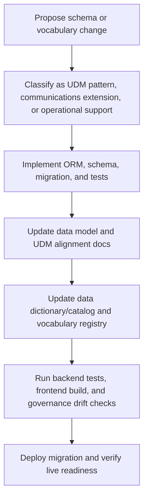

# UDM Alignment

This report documents how the UCM Daily Register application aligns with the
AI4RA Unified Data Model (UDM) conventions adopted by the UI Insight portfolio,
and how it extends those conventions into the communications/newsletter domain.

The canonical UDM is research-administration centered. UCM Daily Register is
not a research-administration application, so most of its tables are not direct
UDM table implementations. Instead, the project uses UDM-derived governance
patterns from OpenERA as the institutional modeling standard.

## Summary Assessment

The project is partially documented for data governance.

What is adequate today:

- The ORM model modules have domain docstrings and mostly follow portfolio
  engineering conventions.
- The application uses `PascalCase_With_Underscores` column names, matching the
  UDM-derived naming convention used by OpenERA.
- Controlled vocabularies are centralized through `allowed_values`.
- The docs include privacy, data model, backup/recovery, audit-logging, and API
  pages.
- The frontend includes a staff-facing Data Governance tab with a searchable,
  expandable catalog modeled after OpenERA's Data Dictionary page.
- Alembic migrations and idempotent seed data provide a reproducible schema and
  bootstrap reference data path.

What is not adequate yet:

- The prior data model docs were stale against the current 16-table ORM surface.
- The portfolio governance registry in `../data-governance` is stale for this
  app: its UCM catalog still lists 10 tables and misses newer fields/tables.
- UCM does not have an OpenERA-style `DataDictionary` table or seeded
  column-level catalog with PII/classification coverage.
- There is no automated drift check comparing ORM metadata, documentation, seed
  data, and the portfolio catalog.
- Some SLC event values are implemented in application code but are not yet
  fully represented in `allowed_values` seed data or the portfolio vocabulary
  registry.
- There is no formal schema change protocol specific to this app that requires
  UDM alignment review, catalog updates, and vocabulary registry updates.

## Relationship to OpenERA and the Portfolio Standard

OpenERA is a reference implementation for applying the AI4RA UDM to research
administration. It implements many canonical UDM entities directly, such as
`Organization`, `Personnel`, `Project`, `Proposal`, `Award`, and
`AllowedValues`, and then documents OpenERA-specific extension tables in a UDM
conformance report.

UCM Daily Register applies the same pattern in a different domain:

1. Use UDM-derived conventions where they are domain-neutral.
2. Reuse the AllowedValue pattern for controlled vocabularies.
3. Treat domain-specific tables as explicit extensions, not accidental
   deviations.
4. Maintain a human-readable alignment report plus machine-readable catalog
   artifacts.

The last item is the main gap for UCM: the alignment report now exists here, but
the machine-readable catalog artifacts in the portfolio governance repository
still need to be refreshed.

## Alignment Matrix

| Standard / Pattern | UCM Status | Notes |
|---|---|---|
| `PascalCase_With_Underscores` columns | Aligned | All ORM columns use names such as `Target_Newsletter`, `Created_At`, and `Submission_Id`. |
| SQLAlchemy imported as `sa` | Aligned | Model modules follow the portfolio convention. |
| Async-safe relationships | Aligned | Relationships use `lazy="selectin"`. |
| Pydantic schema naming | Aligned | Schemas use `Create`, `Update`, `Response`, and list/detail patterns. |
| Frontend type mirroring | Aligned | TypeScript interfaces mirror API response field names. |
| Controlled vocabularies | Aligned with variation | UCM uses `allowed_values` with `(Value_Group, Code)` instead of OpenERA's `AllowedValues` with `(Allowed_Value_Group, Allowed_Value_Code)`. |
| Primary key naming | Legacy variation | UCM uses `Id` UUID strings rather than UDM-style `{Entity}_ID`. |
| Table naming | Legacy variation | UCM uses lowercase plural table names rather than singular PascalCase UDM names. |
| Data dictionary | Missing | No first-class catalog table or column-level classification seed exists yet. |
| Schema/versioning policy | Partial | Alembic exists, but the docs do not yet require governance registry/catalog updates for every schema change. |
| Data lineage | Partial | Privacy/data-flow docs exist, but lineage is not documented at the same level as OpenERA's lifecycle maps. |
| Governance drift validation | Missing | No automated check compares ORM surface to docs/catalog/vocabularies. |

## Table-Level Classification

### UDM-Derived Pattern Tables

| Table | Status | Rationale |
|---|---|---|
| `allowed_values` | UDM-derived pattern | Implements the AllowedValue controlled-vocabulary concept with UCM-specific column names and UUID PKs. |

### Communications Domain Extension Tables

| Table | Extension Area | Rationale |
|---|---|---|
| `submissions` | Content intake | Captures newsletter content and submitter contact metadata. |
| `submission_links` | Content intake | Normalizes multiple links attached to a submission. |
| `submission_schedule_requests` | Content scheduling | Captures requested dates, repeat requests, and recurrence preferences. |
| `edit_versions` | Editorial audit trail | Stores immutable snapshots of original, AI-edited, and final copy. |
| `newsletters` | Publication issue | Represents a dated issue of TDR or My UI. |
| `newsletter_items` | Publication assembly | Places finalized submissions into newsletter sections. |
| `newsletter_external_items` | External content import | Places imported calendar/job content into issues. |
| `newsletter_sections` | Publication structure | Defines governed sections for each newsletter type. |
| `recurring_messages` | Reusable editorial content | Stores staff-managed recurring copy with cadence rules. |
| `recurring_message_issue_overrides` | Reusable editorial content | Records issue-level skips or exceptions. |
| `style_rules` | AI editorial policy | Stores style rules injected into the AI editing prompt. |
| `schedule_configs` | Publication calendar | Defines recurring publishing modes and deadlines. |
| `blackout_dates` | Publication calendar | Blocks publication on holidays or closures. |
| `schedule_mode_overrides` | Publication calendar | Overrides month-based schedule selection for specific date ranges. |
| `custom_publish_dates` | Publication calendar | Adds ad hoc issue dates during non-standard schedules. |

These are not candidates for canonical research-administration UDM tables as-is.
They are better framed as a communications-domain extension that applies UDM
governance patterns to editorial operations.

## Candidate UDM-Adjacent Communications Concepts

If the portfolio later defines a cross-application communications or publishing
domain model, UCM suggests these candidate abstractions:

| Candidate Concept | Current UCM Tables | Purpose |
|---|---|---|
| `ContentSubmission` | `submissions`, `submission_links`, `submission_schedule_requests` | User-submitted content with links and requested publication timing. |
| `EditorialVersion` | `edit_versions` | Immutable editorial snapshots and AI/human edit provenance. |
| `PublicationIssue` | `newsletters` | Dated issue or edition of a publication. |
| `PublicationItem` | `newsletter_items`, `newsletter_external_items` | Item placed into a publication issue from internal or external source content. |
| `PublicationSection` | `newsletter_sections` | Governed section taxonomy for issue assembly. |
| `ReusableMessage` | `recurring_messages`, `recurring_message_issue_overrides` | Centrally managed reusable copy with issue-level exceptions. |
| `PublicationSchedule` | `schedule_configs`, `blackout_dates`, `schedule_mode_overrides`, `custom_publish_dates` | Publish calendar, deadlines, blackout rules, and ad hoc dates. |
| `EditorialRule` | `style_rules` | Machine-readable/editor-readable policy used by AI and human editors. |

These concepts extend the UDM pattern language beyond research administration
without claiming that newsletter production belongs in the canonical research
UDM.

## Controlled Vocabulary Governance

UCM uses 10 bootstrap AllowedValue groups:

| Group | Governance Notes |
|---|---|
| `Submission_Category` | Domain-specific content taxonomy. Includes public and staff-visible categories via `Visibility_Role`. |
| `Newsletter_Type` | Small governed publication list: `tdr`, `myui`. |
| `Target_Newsletter` | Routing discriminator for submissions. |
| `Submission_Status` | Workflow status. Should have a documented transition matrix. |
| `Newsletter_Status` | Issue lifecycle status. Should have a documented transition matrix. |
| `Version_Type` | Editorial-version stage. |
| `Headline_Case` | Editorial style policy. |
| `Rule_Set` | Style-rule scoping. |
| `Severity` | Style-rule/action severity. |
| `Schedule_Mode` | Academic-year, summer, and winter-break schedule behavior. |

Governance gap: runtime additions to `allowed_values` or `style_rules` are not
automatically reflected back into seed data or the portfolio vocabulary
registry. The process should mirror OpenERA's approach: treat seed/catalog data
as governed metadata, not just application fixtures.

## Data Governance Artifact Inventory

| Artifact | Current State | Adequacy |
|---|---|---|
| ORM model docstrings | Present | Good baseline. |
| Alembic migrations | Present | Adequate for reproducible schema evolution. |
| Seed data | Present | Adequate for bootstrap; needs clearer runtime-vs-seed distinction in all docs. |
| Data model doc | Updated in this repo | Adequate as a human-readable inventory after this update. |
| Privacy/data governance doc | Present | Useful, but needs column-level classification and access-control detail. |
| Interactive governance tab | Present in frontend | Useful staff-facing catalog; static until backed by a governed DataDictionary or catalog API. |
| API docs | Present | Good endpoint reference; not a governance catalog. |
| Audit logging doc | Present | Mostly a planned control rather than implemented evidence. |
| Machine-readable catalog | Stale in `../data-governance` | Inadequate until regenerated for the 16-table schema. |
| Vocabulary registry | Stale in `../data-governance` | Inadequate until updated for current seed groups/codes. |
| Data dictionary table | Missing | Needed for OpenERA-style governance parity. |
| Drift validation | Missing | Needed to prevent future docs/catalog/schema drift. |
| UDM alignment report | Added here | Adequate as a starting point; should be mirrored in portfolio governance docs. |

## Recommended Documentation Work

### 1. Refresh the portfolio governance registry

Update the neighboring `data-governance` repository:

- `catalog/ucm-daily-register.json`: regenerate from the 16-table ORM surface.
- `vocabularies/communications/allowed_values.json`: update to current seed
  values, including `employee_announcement`, `survey`, `ucm_feature_story`,
  `pending_info`, `winter_break`, and `Visibility_Role` metadata. Include the
  SLC-only values currently represented in code, such as `slc_event`, `none`,
  `strategic`, and `signature`.
- `docs/domains/communications.md`: update table count, ERD, table inventory,
  and AI/editorial workflow notes.
- `docs/portfolio/applications.md` and `README.md`: update UCM table count.

### 2. Add a UCM data dictionary artifact

Create either:

- a `DataDictionary` table, following OpenERA's operational-support extension,
  or
- a machine-readable JSON/YAML catalog committed to this repo and validated in
  CI.

Minimum fields:

| Field | Purpose |
|---|---|
| `Table_Name`, `Column_Name` | Schema identity |
| `Description` | Steward-readable definition |
| `Data_Classification` | Public, Internal, Confidential, Restricted |
| `Contains_PII` | Boolean |
| `Retention_Category` | Links to retention schedule |
| `AllowedValue_Group` | Where applicable |
| `Source_System` | Submitter, UCM editor, Trumba, PeopleAdmin, AI provider, system |
| `Steward` | Owning role/team |

### 3. Add governance drift checks

Automate checks that fail when:

- SQLAlchemy metadata has tables/columns missing from the catalog.
- The catalog contains tables/columns no longer present in the ORM.
- `backend/data/allowed_values/allowed_values.json` differs from the portfolio
  communications vocabulary registry.
- Docs mention stale table counts or retired fields.

### 4. Formalize lifecycle and lineage docs

Add explicit lifecycle diagrams for:

- submission intake to publication,
- AI edit provenance,
- external calendar/job import into newsletter assembly,
- recurring-message skip/restore behavior,
- schedule-mode and blackout-date resolution.

### 5. Tighten access-control documentation

Keep the trusted-boundary role model and its limits explicit in governance docs.
The backend now rejects client-controlled `X-User-Role` headers and accepts
staff/SLC roles only when `X-Trusted-User-Role` is paired with the configured
`X-Trusted-Auth-Secret`. This is stronger than the earlier prototype header, but
it is still perimeter-trusted rather than per-user OAuth/JWT authorization.
Deployment controls, trusted-header stripping, and campus proxy configuration
remain part of the access-control boundary until stronger auth is implemented.

## Change Management Policy

For future schema changes, use this lightweight UCM-specific governance flow:

Schema changes should not be considered complete until both the application docs
and the portfolio governance registry reflect the new model surface.
